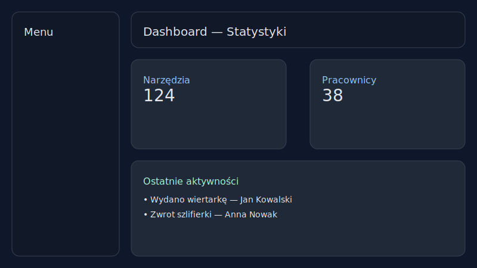
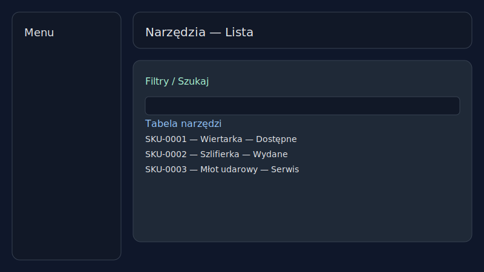
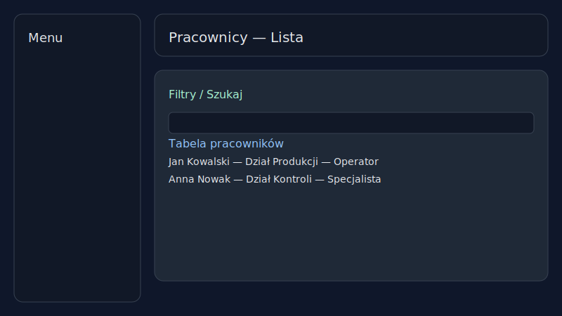
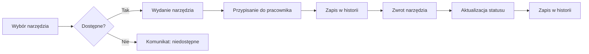

# System Zarządzania Narzędziownią

[](https://github.com/RexEtImperator/system-zarzadzania-narzedziownia/releases/tag/1.4.0)
[](https://github.com/RexEtImperator/system-zarzadzania-narzedziownia/actions/workflows/ci.yml)

System zarządzania narzędziami i pracownikami - aplikacja webowa do zarządzania wypożyczaniem narzędzi w firmie.

## Opis projektu

Aplikacja umożliwia:
- Zarządzanie bazą narzędzi i sprzętem BHP
- Generowanie i wykorzystanie kodów QR/kreskowych (narzędzia)
- Zarządzanie pracownikami i ich danymi
- Wydawanie i zwracanie narzędzi/sprzętu BHP
- Śledzenie historii wydań i zwrotów
- Zarządzanie działami i stanowiskami
- System logowania oraz uprawnień użytkowników (RBAC)
- Przeglądy BHP i terminy kontroli
- Analityka i wykresy (trend, przegląd danych)
- Zarządzanie użytkownikami i rolami
- Kopie zapasowe (backup) i podgląd plików kopii
- Logi audytowe kluczowych akcji

## Technologie

### Frontend
- React.js
- Tailwind CSS
- React Toastify (powiadomienia)

### Backend
- Node.js
- Express.js
- SQLite (baza danych)

## Instalacja

1. Sklonuj repozytorium:
```bash
git clone https://github.com/[username]/system-zarzadzania-narzedziownia.git
cd system-zarzadzania-narzedziownia
```

2. Zainstaluj zależności:
```bash
npm install
```

3. Uruchom serwer backend:
```bash
npm run server
```

4. Uruchom aplikację frontend (w nowym terminalu):
```bash
npm start
```

## Konfiguracja .env

Zalecane zmienne środowiskowe dla rozwoju lokalnego:

- Backend (`.env` w katalogu głównym):
  - `PORT=3000`
  - `JWT_SECRET=twój_sekretny_klucz` (opcjonalnie; w kodzie jest domyślny klucz)
  - `CORS_ORIGINS=http://localhost:3001,http://localhost:3000` (opcjonalnie)

- Frontend (`.env.development.local`):
  - `PORT=3001`
  - `HTTPS=true`
  - `SSL_CRT_FILE=ssl\\localhost.crt`
  - `SSL_KEY_FILE=ssl\\localhost.key`
  - `REACT_APP_API_BASE=http://localhost:3000` (opcjonalnie; w dev działa proxy z `src/setupProxy.js`)

- Certyfikaty i urządzenia mobilne:
  - Wygeneruj certyfikaty: `node generate-ssl.js`, następnie uruchom `install-cert.bat`
  - Instrukcja instalacji certyfikatu na telefonach: [mobile-cert-install.md](mobile-cert-install.md)

Uwagi:
- CRA respektuje `PORT` i `HTTPS` dla frontendu; backend czyta `process.env.PORT`.
- Jeśli `3001` jest zajęty, ustaw inny port w `.env.development.local`.

## Struktura projektu

```
├── .github/
│   └── workflows/
│       └── ci.yml             # Pipeline CI (build/test)
├── public/                    # Pliki statyczne
│   ├── index.html
│   ├── favicon.ico
│   ├── localhost.crt          # Certyfikat dev (HTTPS frontend)
│   └── logos/                 # Zasoby graficzne
├── ssl/                       # Klucze/certyfikaty lokalne
│   ├── localhost.crt
│   └── localhost.key
├── src/                       # Kod źródłowy frontendu (React)
│   ├── App.jsx                # Główny komponent aplikacji
│   ├── api.js                 # Klient API + tokeny
│   ├── constants.js           # Stałe aplikacji
│   ├── index.js               # Punkt wejścia
│   ├── index.css              # Style globalne
│   ├── setupProxy.js          # Proxy do backendu w dev
│   ├── contexts/
│   │   └── ThemeContext.js    # Kontekst motywu
│   ├── utils/
│   │   └── dateUtils.js       # Pomocnicze funkcje dat
│   └── components/            # Ekrany i komponenty UI
│       ├── DashboardScreen.jsx
│       ├── ToolsScreen.jsx
│       ├── EmployeesScreen.jsx
│       ├── BhpScreen.jsx
│       ├── AppConfigScreen.jsx
│       ├── Sidebar.jsx
│       ├── TopBar.jsx
│       └── ...                # Pozostałe komponenty (modale, skanery, itd.)
├── server.js                  # Serwer Express (API, proxy, backupy)
├── backups/                   # Zrzuty kopii zapasowych
├── backend/
│   └── package.json           # Metadane/backend (pomocnicze)
├── test_*.js                  # Skrypty testowe i narzędziowe (dev)
├── generate-ssl.js            # Generator certyfikatów dev
├── install-cert.bat           # Instalator certyfikatu w Windows
├── README.md                  # Dokumentacja
├── CHANGELOG.md               # Zmiany w wersjach
├── license.md                 # Licencja MIT
├── package.json               # Zależności i skrypty npm
└── package-lock.json          # Lockfile npm
```

## Jak uruchomić

- Dev (backend + frontend):
  - `npm run dev`
  - Backend: `http://localhost:3000`
  - Frontend: `https://localhost:3001`
  - Tylko backend: `npm run server`
  - Tylko frontend: `npm start`
  - Build produkcyjny: `npm run build` (wynik w katalogu `build/`)
  - Uwaga: frontend korzysta z portu `3001` (ustawiony w skrypcie `start`). Jeśli port jest zajęty, zwolnij go lub zmień port.

### Zmiany UI w 1.4.0
- Usunięto zakładkę „Etykiety” z nawigacji i trasy aplikacji.
- Usunięto kafelki statystyk z górnej części ekranu „Analityka”.
- Dashboard: zastąpiono kafelek „Stanowiska” kafelkiem „Pracownicy” z łączną liczbą.

## Funkcjonalności

### Konfiguracja aplikacji
- Pionowe zakładki z lewym panelem nawigacyjnym i treścią po prawej
- Sticky lewy panel na wysokich ekranach
- Dynamiczny nagłówek sekcji po prawej (ikona + nazwa aktywnej zakładki)
- Spójne style i placeholdery w modalach

### Dashboard
- Przegląd statystyk narzędzi i pracowników
- Szybkie wydanie i zwrot
- Historia ostatnich aktywności

## Zrzuty ekranu

- Dashboard: 
- Narzędzia (lista): 
- Pracownicy (lista): 

## Diagram procesu wypożyczenia/zwrotu



### Zarządzanie narzędziami
- Dodawanie nowych narzędzi
- Edycja istniejących narzędzi
- Śledzenie statusu (dostępne/wydane/serwis)
- Historia wydań i zwrotów

### Zarządzanie sprzętem BHP
- Dodawanie nowych sprzętów
- Edycja istniejących sprzętów
- Śledzenie statusu (dostępne/wydane)
- Historia wydań i zwrotów

### Zarządzanie pracownikami
- Dodawanie nowych pracowników
- Zarządzanie działami i stanowiskami
- Przypisywanie uprawnień

### System wydań
- Proces wydania i zwrotu narzędzi/sprzętu BHP
- Weryfikacja dostępności, historia operacji

### Logowanie i uprawnienia
- Logowanie z użyciem JWT
- Role i uprawnienia (RBAC), kontrola dostępu do akcji i ekranów
- Warunkowe wyświetlanie elementów UI na podstawie uprawnień

### Działy i stanowiska
- Zarządzanie strukturą organizacyjną: działy i stanowiska
- Przypisanie stanowisk do pracowników

### BHP (przeglądy)
- Przeglądy BHP narzędzi, terminy i przypomnienia
- Usprawnienia sortowania „Najbliższy/Najdalszy”

### Audyt (logi)
- Rejestrowanie istotnych akcji i nawigacji po ekranach
- Wgląd w historię działań użytkowników

### Skaner kodów
- Skanowanie kodów QR i kreskowych (kamera urządzenia)
- Generowanie i wykorzystanie kodów w procesach wypożyczeń

### Konfiguracja / Backup
- Podgląd ostatniej kopii zapasowej i listy plików
- Akcja „Wykonaj kopię” z poziomu UI

### Ustawienia użytkownika
- Preferencje interfejsu, tryb ciemny
- Spójne style i zachowanie modalnych okien

### Powiadomienia
- Toasty informacyjne/sukcesu/błędu dla operacji (React Toastify)

## Licencja

Projekt jest licencjonowany na zasadach MIT. Szczegóły licencji znajdziesz w pliku [license.md](license.md).

## Changelog

Zmiany wersji są opisane w pliku [CHANGELOG.md](CHANGELOG.md). Zobacz wydanie [1.4.0](https://github.com/RexEtImperator/system-zarzadzania-narzedziownia/releases/tag/1.4.0).

## Autor
dbrzezinsky

## Wersja
System Zarządzania Narzędziownią - wersja 1.4.0
