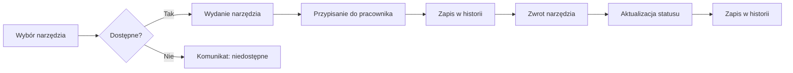

# System Zarządzania Narzędziownią

[](https://github.com/RexEtImperator/system-zarzadzania-narzedziownia/releases/tag/2.2.0)
[](https://github.com/RexEtImperator/system-zarzadzania-narzedziownia/releases/latest)
[](https://github.com/RexEtImperator/system-zarzadzania-narzedziownia/actions/workflows/ci.yml)

System zarządzania narzędziownią i pracownikami - aplikacja webowa do zarządzania wydawaniem/zwracaniem narzędzi przez pracowników w firmie.

## Opis projektu

Aplikacja umożliwia:
- Zarządzanie bazą narzędzi i sprzętem BHP
- Generowanie i wykorzystanie kodów QR/kreskowych (narzędzia)
- Zarządzanie pracownikami i ich danymi
- Wydawanie i zwracanie narzędzi/sprzętu BHP
- Śledzenie historii wydań i zwrotów
- Zarządzanie działami i stanowiskami
- System logowania oraz uprawnień użytkowników (RBAC)
- Przeglądy BHP i terminy kontroli
- Analityka
- Zarządzanie użytkownikami i rolami
- Kopie zapasowe (backup) i podgląd plików kopii
- Logi audytowe kluczowych akcji

## Technologie

### Frontend
- React.js
- Tailwind CSS
- React Toastify (powiadomienia)

### Backend
- Node.js
- Express.js
- SQLite (baza danych)

## Instalacja

1. Sklonuj repozytorium:
```bash
git clone https://github.com/[username]/system-zarzadzania-narzedziownia.git
cd system-zarzadzania-narzedziownia
```

2. Zainstaluj zależności:
```bash
npm install
```

3. Uruchom serwer backend:
```bash
npm run server
```

4. Uruchom aplikację frontend (w nowym terminalu):
```bash
npm start
```

### Wymagania środowiskowe
- Node.js: LTS 22.x (zalecane; projekt definiuje `"engines": { "node": ">=22 <23" }`).
- NPM: wersja `>=9`.
- Opcjonalnie: NVM do zarządzania wersją Node (`.nvmrc` wskazuje `22`).

Na Windows możesz użyć NVM for Windows:
```
nvm install 22
nvm use 22
node -v  # powinno pokazać v22.x.x
```

## Konfiguracja .env

Zalecane zmienne środowiskowe dla rozwoju lokalnego:

- Backend (`.env` w katalogu głównym):
  - `PORT=3000`
  - `JWT_SECRET=twój_sekretny_klucz` (opcjonalnie; w kodzie jest domyślny klucz)
  - `CORS_ORIGINS=http://localhost:3001,http://localhost:3000` (opcjonalnie)

- Frontend (`.env.development.local`):
  - `PORT=3001`
  - `HTTPS=true`
  - `SSL_CRT_FILE=ssl\\localhost.crt`
  - `SSL_KEY_FILE=ssl\\localhost.key`
  - `REACT_APP_API_BASE=http://localhost:3000` (opcjonalnie; w dev działa proxy z `src/setupProxy.js`)

- Certyfikaty i urządzenia mobilne:
  - Wygeneruj certyfikaty: `node generate-ssl.js`, następnie uruchom `install-cert.bat`
  - Instrukcja instalacji certyfikatu na telefonach: [mobile-cert-install.md](mobile-cert-install.md)

Uwagi:
- CRA respektuje `PORT` i `HTTPS` dla frontendu; backend czyta `process.env.PORT`.
- Jeśli `3001` jest zajęty, ustaw inny port w `.env.development.local`.

## Struktura projektu

```
├── .github/
│   └── workflows/
│       ├── ci.yml             # CI: build/test/lint
│       └── release.yml        # Publikacja wydań
├── .gitignore
├── .nvmrc                     # Wersja Node do użytku lokalnego
├── CHANGELOG.md               # Historia zmian
├── LICENSE
├── README.md                  # Dokumentacja projektu
├── app.js                     # Skrypty pomocnicze (narzędzia)
├── backend/
│   └── package.json           # Metadane backendu (pomocnicze)
├── package.json               # Frontend: metadane, zależności, wersja
├── package-lock.json
├── public/                    # Pliki statyczne frontendu
│   ├── index.html
│   ├── favicon.ico
│   ├── localhost.crt          # Certyfikat dev (HTTPS frontend)
│   ├── logo*.png/svg          # Ikony
│   └── logos/
├── scripts/                   # Skrypty narzędziowe
│   ├── generate_logins_for_employees.js
│   ├── normalize_tools_codes.js
│   ├── report_translation_diff.js
│   └── sync_translations_from_files.js
├── server.js                  # Backend (Express, API, i18n)
├── src/                       # Kod źródłowy frontendu (React)
│   ├── App.jsx                # Główny komponent aplikacji
│   ├── App.test.jsx           # Testy jednostkowe
│   ├── api.js                 # Klient HTTP do API
│   ├── constants.js           # Stałe aplikacji
│   ├── index.css              # Style globalne
│   ├── index.js               # Punkt wejścia
│   ├── setupProxy.js          # Proxy do backendu w dev
│   ├── components/            # Ekrany i komponenty UI
│   │   ├── AppConfigScreen.jsx
│   │   ├── AuditLogScreen.jsx
│   │   ├── BarcodeScanner.jsx
│   │   ├── BhpScreen.jsx
│   │   ├── DashboardScreen.jsx
│   │   ├── DbViewerScreen.jsx
│   │   ├── DepartmentManagementScreen.jsx
│   │   ├── EmployeeModal.jsx
│   │   ├── EmployeesScreen.jsx
│   │   ├── InventoryScreen.jsx
│   │   ├── LabelsManager.jsx
│   │   ├── LoginScreen.jsx
│   │   ├── MobileHeader.jsx
│   │   ├── PermissionsModal.jsx
│   │   ├── PositionManagementScreen.jsx
│   │   ├── ReportsScreen.jsx
│   │   ├── Sidebar.jsx
│   │   ├── SkeletonList.jsx
│   │   ├── ToolsScreen.jsx
│   │   ├── TopBar.jsx
│   │   ├── UserManagementScreen.jsx
│   │   ├── UserSettingsScreen.jsx
│   │   └── index.js
│   ├── contexts/              # Konteksty aplikacji
│   │   ├── LanguageContext.jsx
│   │   └── ThemeContext.js
│   ├── i18n/                  # Pliki tłumaczeń bazowych
│   │   ├── de.json
│   │   ├── en.json
│   │   └── pl.json
│   └── utils/                 # Pomocnicze narzędzia
│       ├── dateUtils.js
│       └── statusUtils.js
├── ssl/                       # Klucze/certyfikaty lokalne
│   ├── localhost.crt
│   └── localhost.key
├── tailwind.config.js         # Konfiguracja Tailwind CSS
```

Kluczowe zasady:
- Frontend działa z katalogu `src/` i używa kontekstów `LanguageContext` oraz `ThemeContext`.
- Tłumaczenia bazowe są w `src/i18n/*.json`, a nadpisania pochodzą z bazy i są ładowane przez backend.
- Backend startuje z `server.js` i udostępnia API (w tym administracyjną obsługę tłumaczeń).
- W dev: frontend pod `https://localhost:3001`, backend pod `http://localhost:3000`.

## Jak uruchomić

- Dev (backend + frontend):
  - `npm run dev`
  - Backend: `http://localhost:3000`
  - Frontend: `https://localhost:3001` (proxy do `/api` -> `http://localhost:3000`)
  - Tylko backend: `npm run server`
  - Tylko frontend: `npm start`
  - Build produkcyjny: `npm run build` (wynik w katalogu `build/`)
  - Uwaga: frontend korzysta z portu `3001` (ustawiony w skrypcie `start`). Jeśli port jest zajęty, zwolnij go lub zmień port.

## Funkcjonalności

### Analityka
- W pełni zlokalizowane nagłówki, komunikaty, chipy i stany widoku.
- Eksport serwisu narzędzi do PDF/XLSX z tłumaczonymi tytułami, nagłówkami i nazwami plików.
- Daty w eksporcie formatowane zgodnie z wybranym językiem (locale PL/EN/DE).
- Informacje o uprawnieniach i brakach danych prezentowane w języku użytkownika.

### Konfiguracja aplikacji
- Pionowe zakładki z lewym panelem nawigacyjnym i treścią po prawej
- Sticky lewy panel na wysokich ekranach
- Dynamiczny nagłówek sekcji po prawej (ikona + nazwa aktywnej zakładki)
- Spójne style i placeholdery w modalach

### Tłumaczenia (i18n)
- Zakładka „Tłumaczenie” w sekcji „Kody qr/kreskowe” pozwala edytować tłumaczenia dla języków `PL/EN/DE`.
- Przełącznik języka na górze (PL/EN/DE) — edycja dotyczy tylko wybranego języka.
- Wyszukiwanie po kluczu, szybkie edytowanie i zapis zmian (`Zapisz zmiany`).
- Dodawanie nowych tłumaczeń przez „Dodaj tłumaczenie” (modal: pola `Klucz`, `PL`, `EN`, `DE`).
- Walidacja kolizji klucza — ostrzeżenie i zablokowanie dodania, jeśli klucz już istnieje.
- Tłumaczenia są przechowywane w tabeli bazy danych `translate`; nadpisują wartości z plików `src/i18n/*.json`.
- Frontend ładuje nadpisania dla aktywnego języka i stosuje je w `t()` (priorytet: baza → plik).

Endpointy backendu (i18n):
- `GET /api/translations/:lang` — publiczny, zwraca mapę tłumaczeń dla danego języka (`{ translations: { key: value } }`).
- `GET /api/translate` — administracyjny (wymaga `SYSTEM_SETTINGS`), filtrowanie i podgląd tłumaczeń.
- `PUT /api/translate/bulk` — administracyjny (wymaga `SYSTEM_SETTINGS`), masowa aktualizacja tłumaczeń.

Inicjalizacja bazy:
- Przy pierwszym uruchomieniu po dodaniu funkcji, tabela `translate` jest tworzona i automatycznie wypełniana kluczami z `pl.json`, `en.json`, `de.json`.
- Jeśli backend działał wcześniej, zrestartuj go po aktualizacji, aby utworzyć tabelę i wykonać seed.

Uwagi techniczne:
- `LanguageContext` pobiera nadpisania przez `GET /api/translations/:lang` i stosuje je w funkcji `t()`.
- Błędy użycia `useTheme` poza `ThemeProvider` są tłumaczone kluczem `Theme.useThemeProvider`.
- `src/utils/dateUtils.js` formatuje daty i komunikaty relative time w `PL/EN/DE` (pluralizacja PL, locale `pl-PL/en-GB/de-DE`).

### Dashboard
- Przegląd statystyk narzędzi i pracowników
- Szybkie wydanie i zwrot
- Historia ostatnich aktywności

## Diagram procesu wydania/zwrotu



### Zarządzanie narzędziami
- Dodawanie nowych narzędzi
- Edycja istniejących narzędzi
- Śledzenie statusu (dostępne/wydane/serwis)
- Historia wydań i zwrotów

### Zarządzanie sprzętem BHP
- Dodawanie nowych sprzętów
- Edycja istniejących sprzętów\
- Terminy przeglądów danego sprzętu z przypomnieniem i oznaczeniem 'Po terminie'
- Śledzenie statusu (dostępne/wydane)
- Historia wydań i zwrotów

### Zarządzanie pracownikami
- Dodawanie nowych pracowników
- Przypisywanie działu i stanowiska

### System wydań
- Proces wydania i zwrotu narzędzi/sprzętu BHP
- Weryfikacja dostępności, historia operacji

### Logowanie i uprawnienia
- Logowanie z użyciem JWT
- Role i uprawnienia (RBAC), kontrola dostępu do akcji i ekranów
- Warunkowe wyświetlanie elementów UI na podstawie uprawnień

### Działy i stanowiska
- Zarządzanie strukturą organizacyjną: działy i stanowiska
- Przypisanie działu do stanowiska
- Przypisanie stanowisk do pracowników

### BHP (przeglądy)
- Przeglądy BHP narzędzi, terminy i przypomnienia
- Usprawnienia sortowania „Najbliższy/Najdalszy”

### Audyt (logi)
- Rejestrowanie istotnych akcji i nawigacji po ekranach
- Wgląd w historię działań użytkowników

### Skaner kodów
- Skanowanie kodów QR i kreskowych (kamera urządzenia)
- Generowanie i wykorzystanie kodów w procesach wydań
- Zlokalizowane komunikaty o zgodności przeglądarki, dostępie do kamery i stanie skanowania.
- Wskazówki skanowania dostosowane językowo; obsługa latarki (torch) tam gdzie wspierane.
- Czytelne komunikaty przy odmowie uprawnień kamery oraz bezpieczne wyłączenie strumienia.

### Konfiguracja / Backup
- Podgląd ostatniej kopii zapasowej i listy plików
- Akcja „Wykonaj kopię” z poziomu UI

### Ustawienia użytkownika
- Preferencje interfejsu, tryb ciemny
- Spójne style i zachowanie modalnych okien

### Powiadomienia
- Toasty informacyjne/sukcesu/błędu dla operacji (React Toastify)
- Globalna konfiguracja: `ToastContainer` z `autoClose=2500ms`, ukrytym paskiem postępu, motywem `colored` i spójnym stylem.
- Ujednolicone helpery na ekranie „Konfiguracja” (`notifySuccess`/`notifyError`).

### Języki (i18n)
- Obsługa wielu języków interfejsu: polski (`pl`), angielski (`en`) i niemiecki (`de`).
- Kontekst języka: `src/contexts/LanguageContext.jsx` z metodą `t(key, params)` i wyborem języka.
- Słowniki: `src/i18n/pl.json`, `src/i18n/en.json`, `src/i18n/de.json` — dodawaj nowe klucze według konwencji kropkowej.
- Integracja m.in. w ekranach: Analityka, Skaner kodów, Ustawienia użytkownika, Logowanie, Modale potwierdzeń.
- Szczegóły architektury i utrzymania: [i18n.md](./i18n.md)

### Prefiksy kodów
- Prefiks dla narzędzi (`toolsCodePrefix`).
- Prefiksy per kategoria narzędzia (`toolCategoryPrefixes`) konfigurowalne w zakładce „Kody qr/kreskowe”.
- Logika w UI: prefiks kategorii ma pierwszeństwo nad prefiksem narzędzi.

Uwaga: od wersji 1.8.0 usunięto przestarzałe pola `codePrefix` (ogólny prefiks) oraz `defaultItemName`. Frontend i backend nie korzystają z nich.

#### Nowości w 1.9.0
- Dashboard → „Szybkie wydanie narzędzia”: obsługa multi-skanowania i wydania wsadowego (lista pozycji z ilościami, integracja skanera, walidacje dostępności).
- Etykiety → „Edytor osobnych szablonów”: przeciąganie Tytułu/SKU/Informacji w podglądzie oraz automatyczne skalowanie tekstów dla rozmiarów 51×32, 70×40 i 110×60 mm.
- Etykiety: eksport PNG zgodny dokładnie z wybranym rozmiarem etykiety; poprawiona zgodność rozmiaru kodu kreskowego pomiędzy podglądem a eksportem.

### Narzędzia — nowe funkcje
- Sortowanie tabeli po numerze ewidencyjnym rosnąco (puste wartości na końcu).
- Elektronarzędzia: podpowiedzi pól „Producent”, „Model”, „Rok produkcji” zasilane z backendu (endpoint sugestii) z bezpiecznym fallbackiem do danych wczytanych na froncie.
- Szczegóły narzędzia: wyświetlanie „Producent”, „Model”, „Rok produkcji” dla kategorii „Elektronarzędzia”.
- Eksporty PDF/XLSX: lista i szczegóły zawierają pola „Producent”, „Model”, „Rok produkcji”.

### API — endpoint sugestii (Elektronarzędzia)
- `GET /api/tools/suggestions?category=Elektronarzędzia`
  - Zwraca:
    - `manufacturers`: tablica unikalnych producentów
    - `models`: tablica unikalnych modeli
    - `years`: tablica unikalnych lat produkcji (liczby)
  - Przykład odpowiedzi:
    ```json
    {
      "manufacturers": ["Bosch", "Makita"],
      "models": ["GSR 12V", "DHP482"],
      "years": [2020, 2021, 2022]
    }
    ```

## Licencja

Projekt jest licencjonowany na zasadach GPL-3.0. Szczegóły licencji znajdziesz w pliku [license.md](license.md).

## Changelog

Zmiany wersji są opisane w pliku [CHANGELOG.md](CHANGELOG.md). Zobacz wydanie [2.2.0](https://github.com/RexEtImperator/system-zarzadzania-narzedziownia/releases/tag/2.2.0).

## Autor
dbrzezinsky

## Wersja
System Zarządzania Narzędziownią - wersja 2.2.0